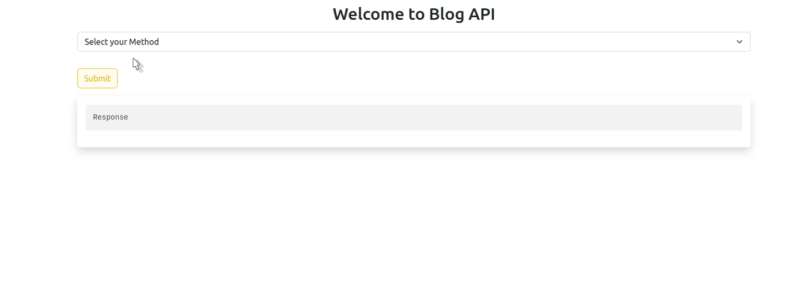
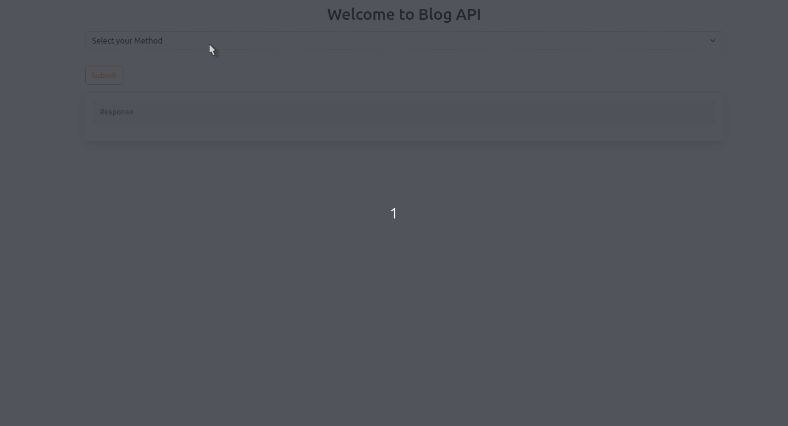
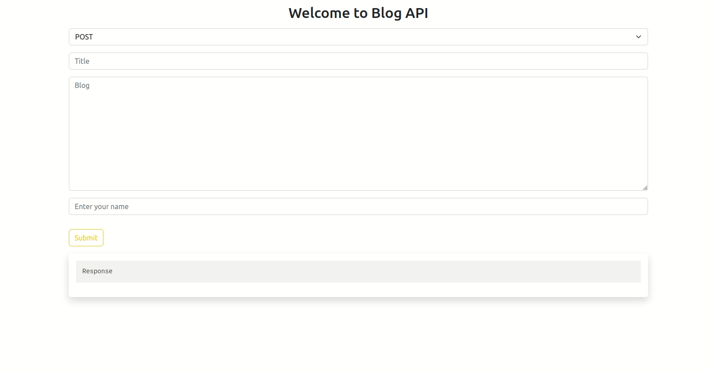
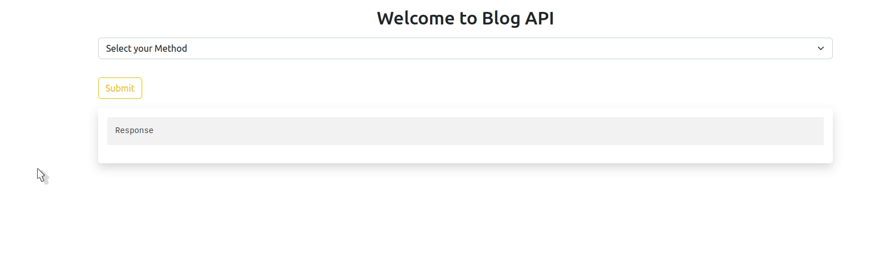

# Blog API

|Method|URL|Description|
|:---:|:---:|:---:|
| GET  | /api | Get all blog posts |
| PUT  | /api | Update a blog post |
| POST | /api | Add a blog post |
| DELETE | /api | Delete a blog post |

### GET Request

### PUT Request

### POST Request

### DELETE Request

